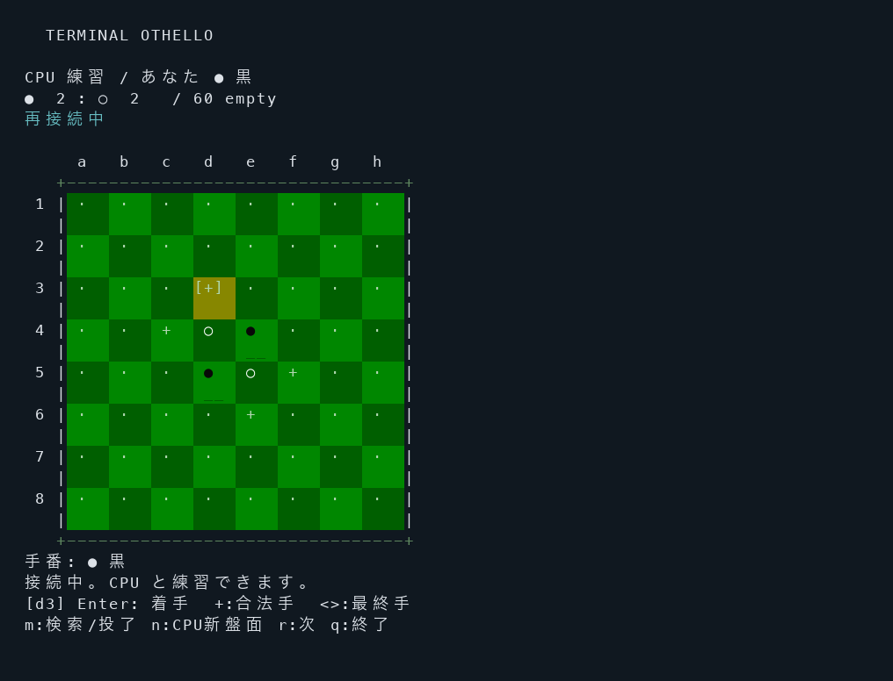

<p align="center"><strong>English</strong> / <a href="README.ja.md">日本語</a></p>

<h1 align="center">Terminal Games</h1>
<p align="center">Small games. Real terminals. No browser gameplay.</p>

| Game | Play | Requirements |
| --- | --- | --- |
| [● Terminal Othello ○](terminal-othello/README.md) | Random online matches; local CPU practice while waiting | Node.js 22+, macOS / Linux terminal; minimum 40 × 22 |
| [Terminal Dojo](terminal-dojo/README.md) | Offline CPU fighting: bait, evade, punish | Python 3.9+, POSIX terminal with curses; minimum 64 × 22 |

Both games use standard runtime libraries. No player account or runtime package installation is needed. Their source, tests, and launch commands are independent. Game messages and Othello's Codex Action names are currently Japanese; the documentation is bilingual.

## Get and play

```sh
git clone https://github.com/HirokiKobayashi-R/games.git
cd games
node terminal-othello/client.js --url https://terminal-othello.hiroki-c3a.workers.dev
```

For Dojo, from the `games` root:

```sh
python3 terminal-dojo/dojo.py
```

Othello starts searching immediately; play the CPU until an opponent arrives. Use arrows / coordinates + Enter; `q` quits. Dojo starts with Enter: move A/D, jump W, attack J, guard K, pause P, quit Q. See each game's guide for all controls.

Prefer downloads? [Release v0.2.0](https://github.com/HirokiKobayashi-R/games/releases/tag/v0.2.0) contains `terminal-othello-source.tar.gz`, `terminal-dojo-source.tar.gz`, a local npm tarball for Othello, and `SHA256SUMS`. Extract only the game you want, then run `node client.js --url https://terminal-othello.hiroki-c3a.workers.dev` or `python3 dojo.py` inside its directory. GitHub authentication is not required. Neither game is published to the npm registry.

## Othello preview



Static reconstruction of real PTY output with illustrative fonts, not a Terminal GUI screenshot. The main view uses green tiles, shaded ●/○ discs, legal-move and cursor markers, and a nonblocking 240 ms flip. `NO_COLOR=1` disables colors and animation. Short terminals use a compact view; undersized terminals show a resize notice. Fonts and terminal themes affect the final appearance.

## Codex

Open this repository as a local Codex project and use the supplied **Terminal games** environment. The macOS Actions launch Othello, monitored Othello, or Dojo. Monitored Othello requires reviewing and trusting six project hooks and resigns when work completes, needs approval, is interrupted, or ends. [English setup](terminal-othello/codex/README.md) · [日本語](terminal-othello/codex/README.ja.md).

Actual Codex Actions UI and real callbacks remain unverified; synthetic-event PTY tests cover resignation and restoration. Work Cloud parent-task monitoring is unsupported. No global configuration or trust setting is automatically changed. Dojo has no lifecycle integration.

## Public API and scope

Only Othello uses the existing public API. It runs on Cloudflare Workers Free + SQLite Durable Objects via workers.dev. **Free is limited**, and this PoC caps admission at **128 sessions**. Account quotas are shared; exceeding free-tier limits can stop requests. See [Othello limits](terminal-othello/README.md#public-api-and-limits) and [Cloudflare pricing](https://developers.cloudflare.com/durable-objects/platform/pricing/). No large-scale availability guarantee. Dojo is offline and consumes no API quota. No server redeployment is needed for this collection.

Each game documents its tests. macOS PTY verification covers operation, resize, results, and terminal restoration; other OS/font combinations and real keyboard feel need user testing. The game directories can be extracted and used independently. The root `.codex` definitions support the collection; Othello also carries standalone definitions. Repeated hook events do not restart a stopped turn.

## License and migration

No project license has been selected or added. Public source is not an open-source license grant. Othello retains `private: true` to prevent npm registry publication; local tarball installation works.

This repository is the new home for Terminal Othello and Terminal Dojo. Older standalone Othello releases are separate snapshots. Use this repository and its releases for the current versions.
